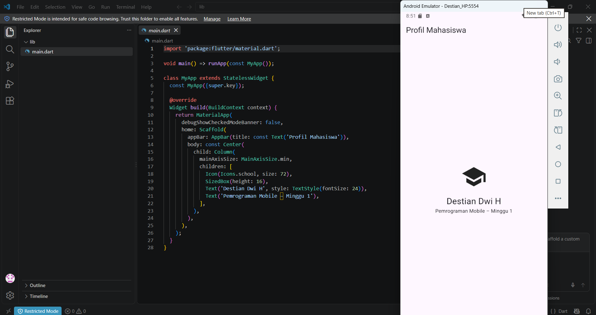

# my_first_app

# Week 1 - Mobile Development Ecosystem & Flutter Refresh

Dokumentasi tugas praktikum Minggu 1 untuk mata kuliah Pemrograman Mobile.

## Identitas Mahasiswa
- **Nama**: Destian Dwi H
- **NIM**: 244107020203
- **Kelas**: TI-2F

---

## 1. Tujuan
- Memahami dan memplajari tentang pemrograman mobile seperti flutter

---

## 2. Fitur Utama
- **Tampilan Profil Ringkas**: Menampilkan ikon topi, nama mahasiswa, dan keterangan minggu praktikum secara terpusat (*center-aligned*).
- **Clean UI**: Antarmuka bersih tanpa banner debug (`debugShowCheckedModeBanner: false`).

---

## 3. Stack Teknologi
- **Framework**: Flutter (v3.47+)
- **Bahasa Pemrograman**: Dart
- **Target OS**: Android (API Level 35 - VanillaIceCream)
- **IDE**: Visual Studio Code / Android Studio
- **Emulator**: Android Virtual Device (Destian_HP)

---

## 4. Cara Menjalankan

1. **Prasyarat**: Pastikan Flutter SDK, Android SDK, dan emulator sudah terkonfigurasi.
2. **Buka Terminal / CMD**, lalu masuk ke direktori proyek ini: `cd 01-week-1-mobile-development-ecosystem-flutter-refresh`
3. Jalankan perintah pengunduhan dependencies: `flutter pub get`
4. Jalankan aplikasi ke emulator: `flutter run`

---

## 5. Hasil yang Dicapai & Bukti Visual

Aplikasi berhasil dibangun dan berjalan tanpa kendala pada emulator Android.

### Screenshot Aplikasi

### Mini Assignment & Kendala Setup
* **Penjelasan Kendala Setup**: Jalur (*path*) Android SDK tidak terdeteksi oleh Flutter (`Unable to locate Android SDK` / `No valid Android SDK platforms found`), sehingga perintah `flutter doctor` mendeteksi *issue* pada Android toolchain.
* **Solusi**: Mengonfigurasi lokasi Android SDK secara manual pada Flutter dengan perintah `flutter config --android-sdk "C:\Users\USER\AppData\Local\Android\Sdk"` serta mengunduh komponen SDK platform yang sesuai melalui SDK Manager di Android Studio.

### Refleksi

1. **Kapan native lebih tepat dipilih daripada cross-platform?**
   - *native* lebih tepat dipilih jika aplikasi membutuhkan akses mendalam ke fitur spesifik hardware/OS (seperti sensor khusus, Bluetooth LE, atau camera API lanjutan)

2. **Bagaimana perubahan state berhubungan dengan widget tree dan UI deklaratif?**
   - Dalam UI deklaratif, tampilan layar adalah hasil langsung dari data (*state*). Saat *state* berubah, Flutter otomatis meng-update (*rebuild*) bagian *widget tree* yang relevan agar sesuai dengan data terbaru tanpa perlu mengedit komponen UI secara manual

3. **Mengapa commit kecil dengan pesan jelas bermanfaat bagi pekerjaan tim dan portfolio?**
   - *Commit* kecil membuat pelacakan bug dan pengembalian kode (*rollback*)  sehingga mempermudah tim dan membuat riwayat *commit* menjadi rapi