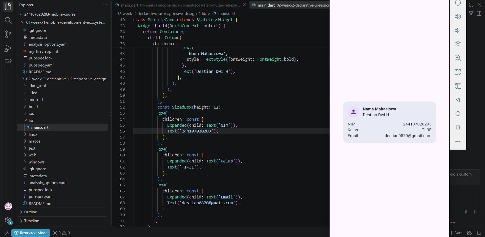
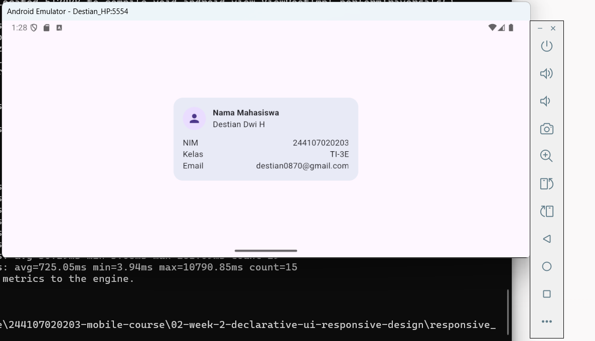
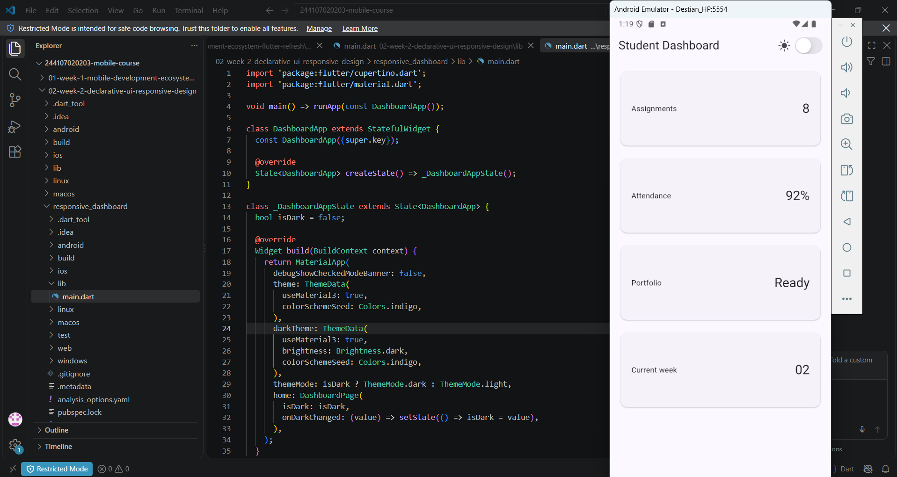
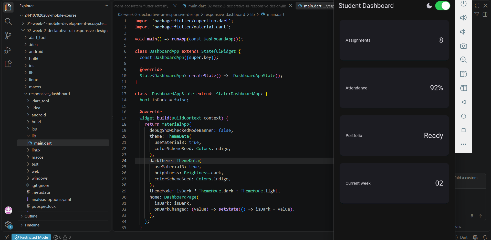
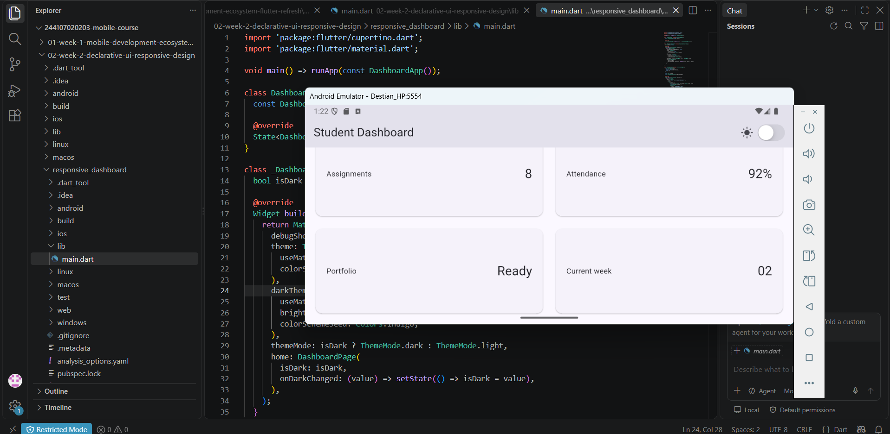
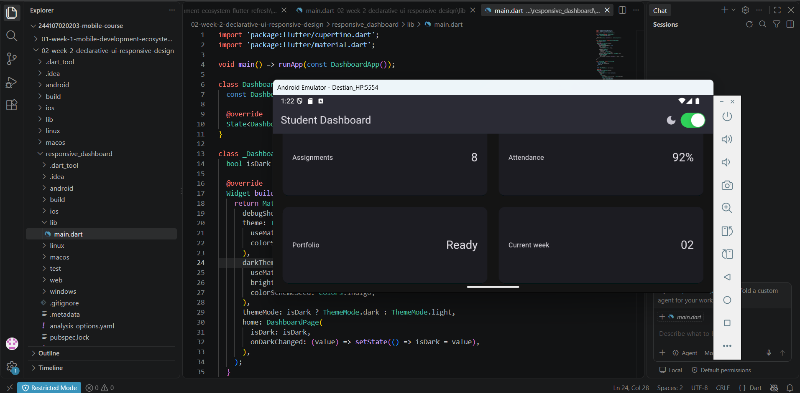
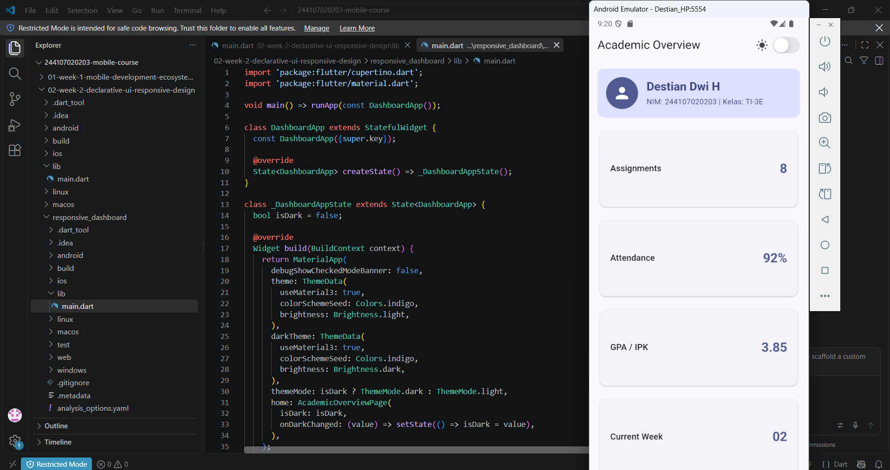
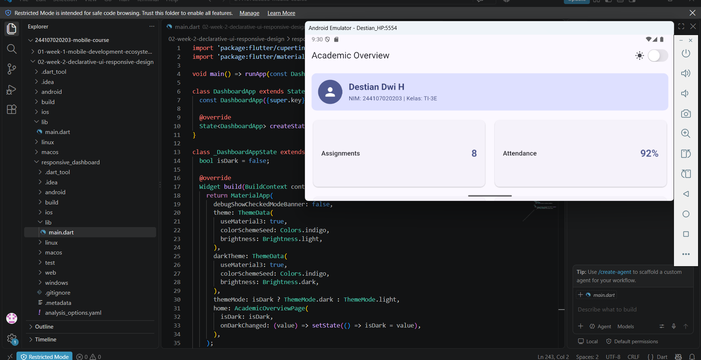

# Laporan Praktikum Minggu 2: Declarative UI & Responsive Design

## 1. Identitas Mahasiswa
- **Nama**: Destian Dwi H
- **NIM**: 244107020203
- **Kelas**: TI-3E
- **Mata Kuliah**: Pemrograman Mobile

---

## 2. Tentang Project
Project ini Melnjutkan sebuah aplikasi identitas mahasiswa dari praktikum sebelum ya dengan penambahan fitur sebagai berikut.
---

## 3. Fitur
- **Header Profil**: Menampilkan data singkat mahasiswa (Nama, NIM, Kelas) menggunakan `Container`, `Row`, `Column`, dan `CircleAvatar`.
- **Kartu Informasi Akademik**: Menampilkan 4 indikator utama (Assignments, Attendance, GPA/IPK, dan Current Week).
- **Layout Responsif**: Beralih otomatis antara 1 kolom (layar sempit < 700px) dan 2 kolom (layar lebar ≥ 700px) menggunakan `LayoutBuilder` dan `GridView`.
- **Toggle Light / Dark Theme**: Mendukung mode terang dan gelap yang dapat diubah menggunakan `CupertinoSwitch`.
- **Aksesibilitas**: Dilengkapi widget `Semantics` pada switch dan kartu informasi agar ramah terhadap *Screen Reader*.

---

## 4. Teknologi & Perangkat Software yang Digunakan
- **Framework**: Flutter (Dart SDK)
- **IDE / Text Editor**: Visual Studio Code (VS Code)
- **Design Pattern / State**: Declarative UI (`StatefulWidget` & `StatelessWidget`)
- **Package Material & Cupertino**: `package:flutter/material.dart` & `package:flutter/cupertino.dart`
- **Testing**: Flutter Test (`package:flutter_test/flutter_test.dart`)
- **Version Control**: Git & GitHub

---

## 5. Praktikum
### Layout Sederhana (Warm-up)
- Mempelajari dan menerapkan konsep dasar Declarative UI pada Flutter.
- Menyusun tata letak komponen utama seperti `Row`, `Column`, `Container`, dan `Expanded`.
- Membuat struktur tampilan awal untuk informasi profil dan kartu akademik.

**Screenshot Hasil Praktikum:**
- *Tampilan Kode & Emulator Layout Sederhana 1*:  
  
- *Tampilan Kode & Emulator Layout Sederhana 2*:  
  

---

### Dashboard Responsif
- Membangun layout yang adaptif terhadap perubahan ukuran layar menggunakan `LayoutBuilder` dan `GridView`.
- Menerapkan breakpoint responsif **`kWideBreakpoint = 700`**.
- Menambahkan switcher tema (Light/Dark Mode) dan penanganan kontras warna dinamis dengan `Theme.of(context)`.
- Menambahkan dukungan label aksesibilitas (`Semantics`).

**Screenshot Hasil Praktikum:**
- *Tampilan Praktikum 2 - Gambar 1*:  
  
- *Tampilan Praktikum 2 - Gambar 2*:  
  
- *Tampilan Praktikum 2 - Gambar 3*:  
  
- *Tampilan Praktikum 2 - Gambar 4*:  
  

---

## 6. Tugas (AI Prompt Challenge & Dokumen Tugas)

### A. Tugas Utama
Mengembangkan dashboard **Academic Overview** yang responsif, mendukung pilihan tema Light/Dark mode, serta menerapkan struktur widget yang bersih.

**Hasil:**
   - *Tampilan Tugas Utama - Layar Sempit / Refactoring 1*:  
     
   - *Tampilan Tugas Utama - Layar Lebar / Refactoring 2*:  
     

### AI Prompt Challenge

#### 1. Prompt Desain
- **Prompt**:  
  > *"Bandingkan dua tata letak dashboard akademik untuk Flutter: versi GridView dan versi LayoutBuilder + Column. Jelaskan trade-off responsif dan aksesibilitasnya."*[cite: 13]
- **Output & Keputusan**:  
  - **`GridView`**: Sangat efisien untuk menyusun item dalam grid 2 dimensi secara otomatis, namun kurang fleksibel jika kartu memiliki ukuran atau struktur berlainan pada kondisi tertentu[cite: 13].  
  - **`LayoutBuilder` + `Column`/`Row`**: Memberikan kontrol penuh untuk merestrukturisasi layout secara ekstrem berdasarkan batas lebar layar (`constraints.maxWidth`)[cite: 13].  
  - **Keputusan**: Menggunakan `LayoutBuilder` dipadu dengan `Column` dan `Row` untuk fleksibilitas perpindahan dari 1 kolom ke 2 kolom secara bersih[cite: 13].

#### 2. Prompt Penguatan Konsep
- **Prompt**:  
  > *"Jelaskan kapan penggunaan Expanded justru menyebabkan overflow di dalam Row, beri contoh kode yang gagal dan perbaikannya."*[cite: 13]
- **Output & Keputusan**:  
  - **Masalah**: `Expanded` membutuhkan batasan lebar pasti dari parent-nya. Jika ditaruh di dalam `Row` yang berada di dalam widget berukuran tak terbatas (*unbounded width*), seperti `SingleChildScrollView` horizontal, Flutter tidak bisa menghitung sisa ruang dan memicu error/overflow[cite: 13].  
  - **Perbaikan**: Mengganti `Expanded` dengan widget yang memiliki lebar eksplisit seperti `SizedBox(width: ...)` atau menghapus scroll horizontal jika menggunakan `Expanded`[cite: 13].

#### 3. Verification Prompt (Audit AI)
- **Prompt**:  
  > *"Periksa kembali rekomendasi layout di atas: apakah tetap responsif di bawah 600px, apakah mengurangi aksesibilitas, dan apakah ada widget yang tidak tersedia di Flutter stabil saat ini?"*[cite: 13]
- **Hasil Audit**:  
  - **Responsivitas (<600px)**: Terverifikasi aman. Pada layar <700px layout otomatis runtuh (*collapse*) menjadi 1 kolom vertikal tanpa terjadi horizontal overflow[cite: 13].  
  - **Aksesibilitas**: Terverifikasi aman. Seluruh komponen utama dikemas dalam widget `Semantics` dengan label yang jelas untuk *screen reader*[cite: 13].  
  - **Ketersediaan Widget**: Terverifikasi. Seluruh widget yang digunakan (`LayoutBuilder`, `Container`, `Row`, `Column`, `CupertinoSwitch`, dll.) merupakan widget bawaan resmi saluran *Flutter Stable*[cite: 13].

  ## Checklist Verifikasi

- [Berhasil] `flutter analyze` tidak menghasilkan error atau warning baru.
- [Berhasil] `flutter test` berhasil dijalankan.
- [Berhasil] Header profil tersedia.
- [Berhasil] Minimal empat kartu informasi tersedia.
- [Berhasil] Menggunakan `Row`, `Column`, `Expanded`, dan `Container`.
- [Berhasil] Light theme dapat digunakan.
- [Berhasil] Dark theme dapat digunakan.
- [Berhasil] Toggle tema dapat digunakan.
- [Berhasil] layar sempit dan layar lebar screenshot tersimpan.