# Laporan Praktikum Week 3: Navigation & State Management

**Nama:** Destian Dwi H  
**NIM:** 244107020203  
**Kelas:** TI-2F  

---

## Deskripsi Tugas
Praktikum ini mempelajari implementasi navigasi deklaratif menggunakan **GoRouter** dan manajemen state aplikasi menggunakan **Flutter Riverpod** (`Notifier`, `ConsumerWidget`, dan `AsyncValue` / `FutureProvider`).

---

## Dokumentasi Praktikum

### Percobaan 1: Navigasi & Routing Dasar (GoRouter)
- **P1_G1:** Implementasi dasar konfigurasi GoRouter dan tampilan halaman navigasi.

  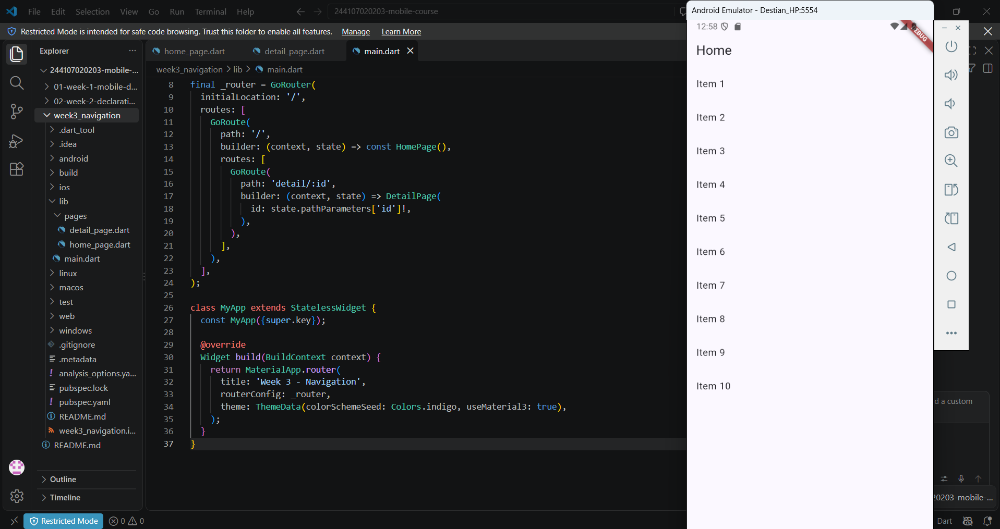

---

### Percobaan 2: State Management dengan Riverpod (Notifier & ConsumerWidget)
- **P2_G1:** Pengelolaan state interaktif dan perubahan tampilan widget.
- **P2_G2:** Verifikasi reaksi UI terhadap pembaruan state pada provider.

  | Percobaan 2 - Gambar 1 | Percobaan 2 - Gambar 2 |
  |---|---|
  | 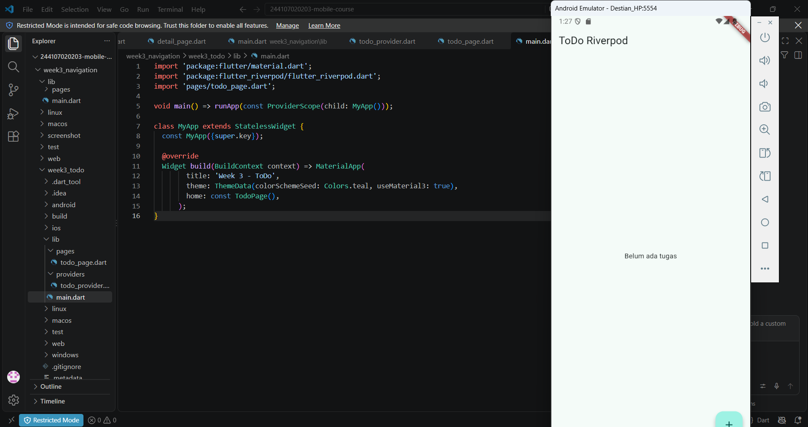 | 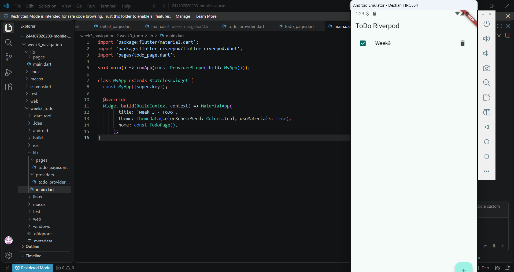 |

---

### Percobaan 3: Simulasi Asinkron & AsyncValue
- **P3_G1:** Penanganan state loading saat data asinkron dimuat.
- **P3_G2:** Tampilan data saat sukses didapatkan (Success State).
- **P3_G3:** Penanganan error state pada pemrosesan asinkron.

  | Loading State | Success State | Error State |
  |---|---|---|
  | 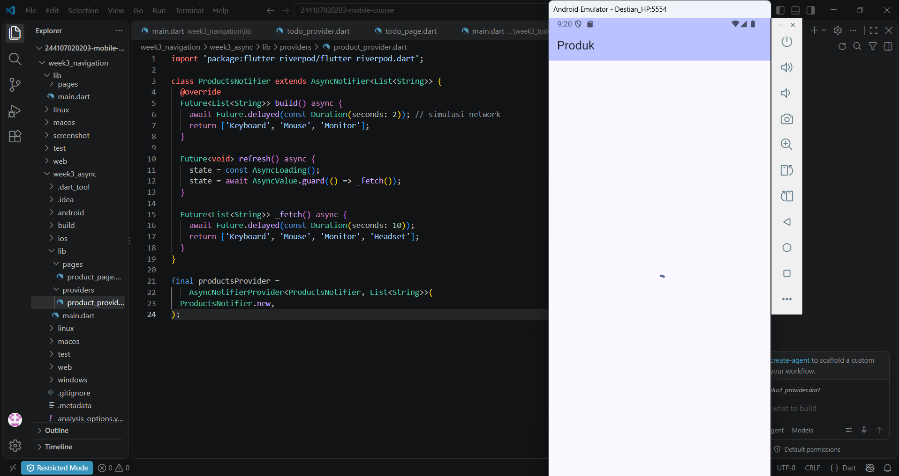 | 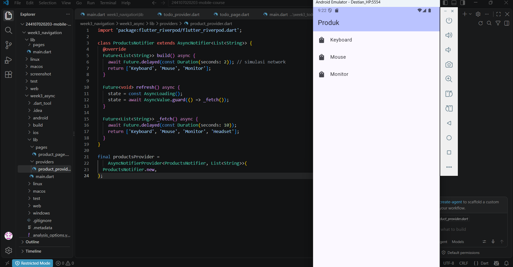 | 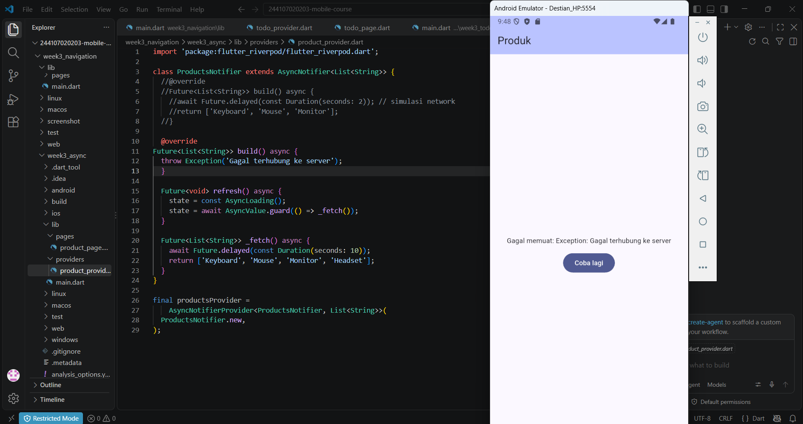 |

---

### Sync & Analisis (week3_async)
- **Sync_G1:** Hasil analisa kode `flutter analyze` pada project `week3_async` (No issues found).
- **Sync_G2:** Hasil pengujian unit test `flutter test` pada project `week3_async` (All tests passed).

  | Flutter Analyze (week3_async) | Flutter Test (week3_async) |
  |---|---|
  | 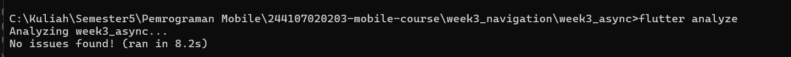 | 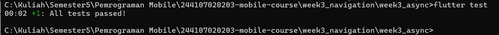 |

---

## Industry Challenge / Mini Project (week3_todo)

Aplikasi **ToDo App** dengan fitur navigasi tab dan kalkulasi statistik secara asinkron menggunakan Riverpod.

### Fitur Utama
1. **Navigasi Bottom Navigation Bar (`go_router`):**
   - Tab **ToDo**: Halaman untuk melihat, menambah, mencentang, dan menghapus daftar tugas.
   - Tab **Statistik**: Halaman kalkulasi statistik tugas (Total, Selesai, Pending) yang dimuat secara asinkron (`FutureProvider`).
2. **State Management (`flutter_riverpod`):**
   - Menggunakan `StateNotifierProvider` / `Notifier` untuk manajemen list tugas.
   - Menggunakan `FutureProvider` dan `AsyncValue.when` untuk menangani kalkulasi statistik tugas dengan state loading dan data success.

### Hasil Pengujian & Tampilan Aplikasi
- **Tugas_G1:** Tampilan Halaman Utama ToDo.
- **Tugas_G2:** Tampilan Halaman Statistik Tugas (`AsyncValue`).
- **Tugas_G3:** Hasil perintah `flutter analyze` pada `week3_todo` (No issues found).
- **Tugas_G4:** Hasil perintah `flutter test` pada `week3_todo` (All tests passed).

| Halaman ToDo | Halaman Statistik |
|---|---|
| 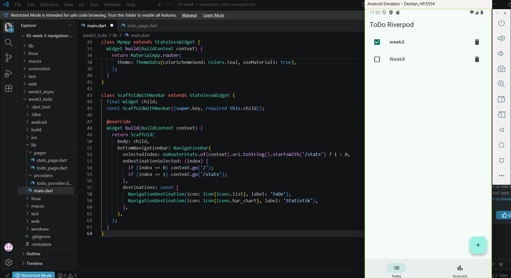 | 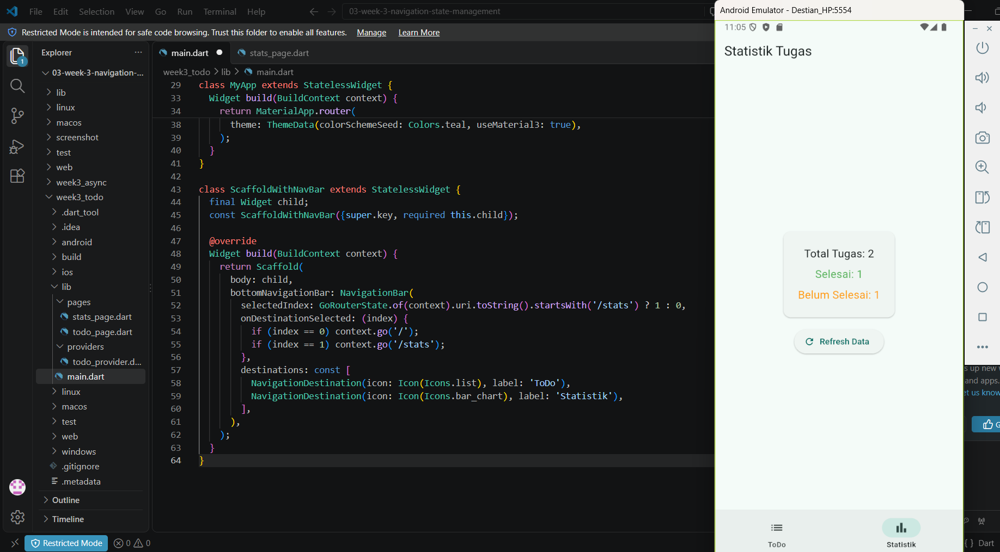 |

| Flutter Analyze (`week3_todo`) | Flutter Test (`week3_todo`) |
|---|---|
| 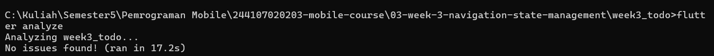 | 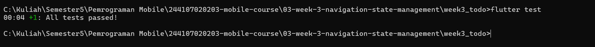 |

---

## AI Challenge & Keputusan Teknis

### Prompt & Bantuan AI
1. **Penyelarasan Test & Riverpod:**
   - **Problem:** Terjadi error `Bad state: No ProviderScope found` saat menjalankan `flutter test` karena widget test default belum dibungkus `ProviderScope`.
   - **Solusi AI:** Membungkus widget `MyApp` dengan `ProviderScope` di `test/widget_test.dart` sehingga unit test berjalan pas 100%.
2. **Kalkulasi Asinkron Statistik:**
   - **Solusi AI:** Membuat `statsAsyncProvider` menggunakan `FutureProvider` untuk mensimulasikan pemrosesan asinkron statistik tugas, lalu menampilkannya menggunakan `AsyncValue.when()` di `stats_page.dart`.

### Keputusan Teknis
- Memisahkan kode UI ke dalam direktori `lib/pages/` (`todo_page.dart`, `stats_page.dart`) dan provider ke `lib/providers/` (`todo_provider.dart`) untuk menjaga arsitektur kode tetap bersih dan terstruktur.