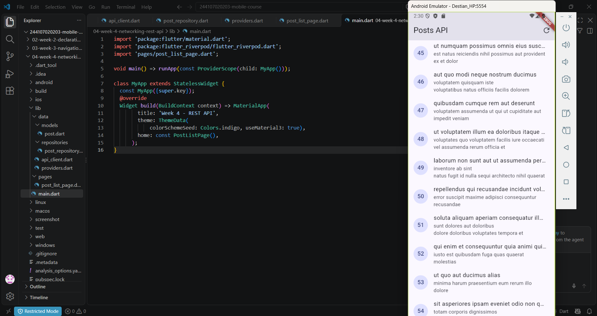
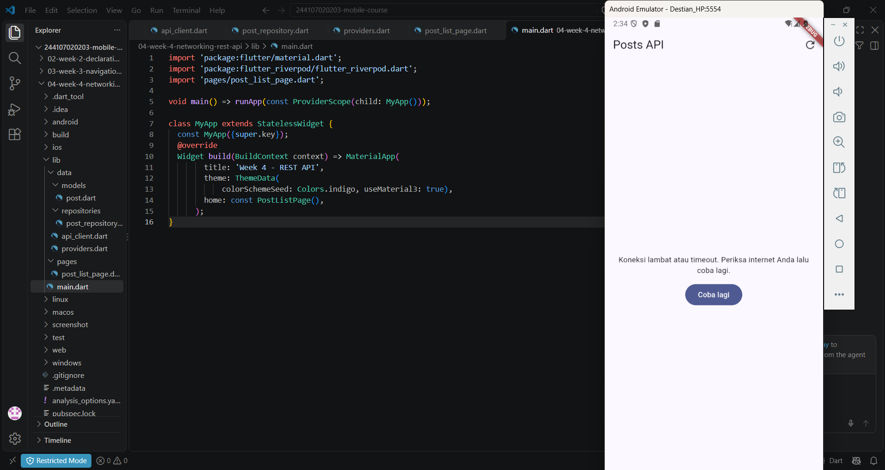
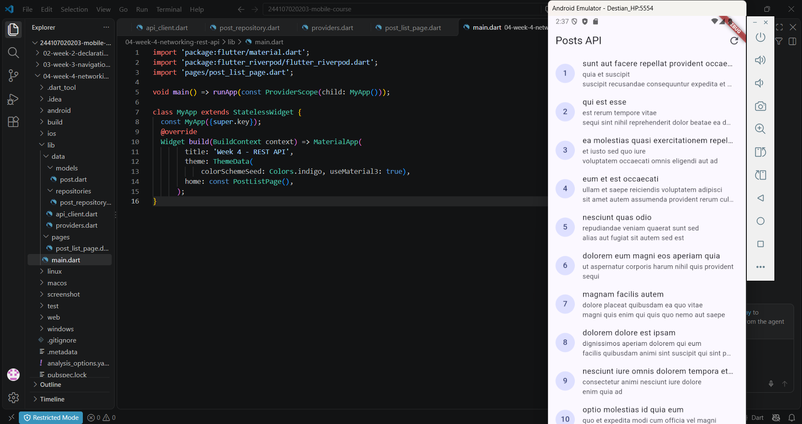
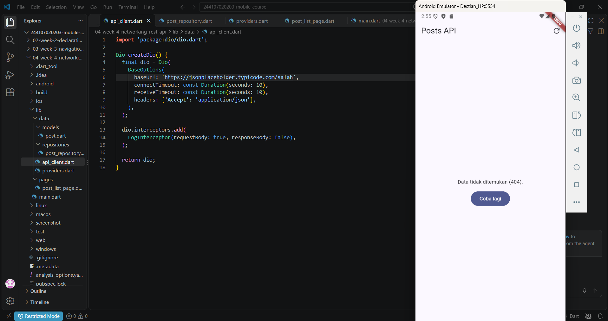
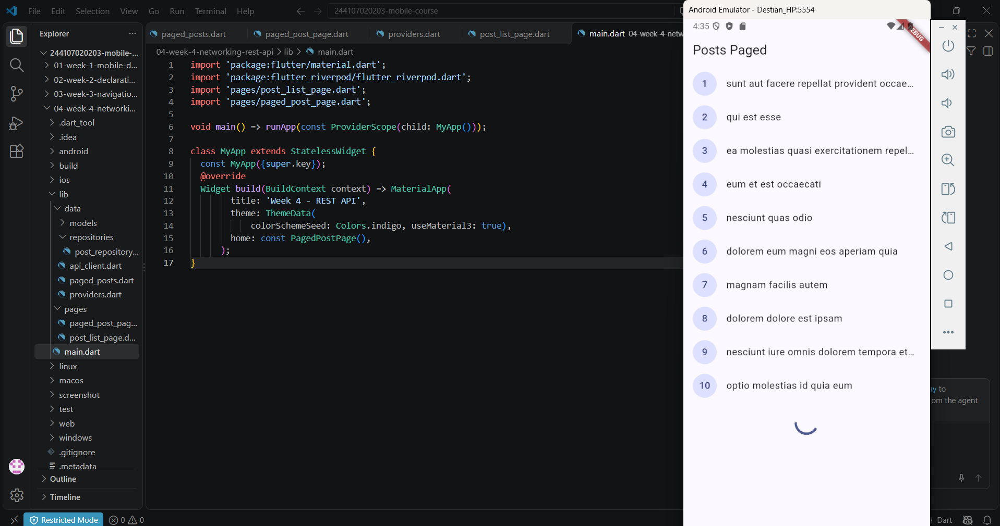
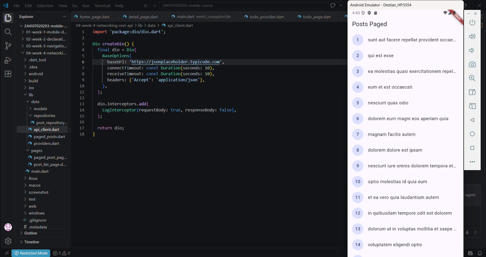
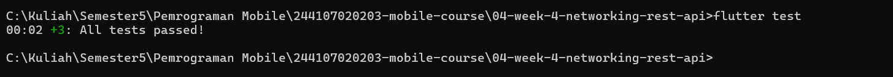
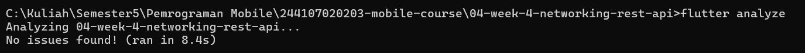
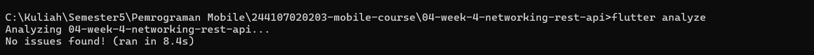
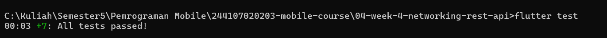

# Week 4 - Networking & REST API

Repositori ini berisi laporan praktikum, kode sumber, dan dokumentasi pengerjaan **Week 4: Networking & REST API** menggunakan Flutter, Dio, Riverpod, serta implementasi *Unit Testing* & *Refactoring*.

## 📌 Identitas Mahasiswa
* **Nama:** Destian Dwi Hardika
* **NIM:** 244107020203
* **Kelas:** TI-2F (Teknologi Informasi - Politeknik Negeri Malang)

---

## 📋 Laporan & Alur Praktikum

### 1. Praktikum 1: Pengenalan REST API & Klien HTTP Dio
* **Penjelasan & Isi:** 
  Pada praktikum ini, dilakukan instalasi paket `dio`, konfigurasi dasar klien HTTP terpusat (`api_client.dart`) yang mencakup pengaturan *Base URL*, *timeout*, serta *interceptor* logging untuk memantau request dan response jaringan.
* **Screenshot Terkait:**
  

    
  

---

### 2. Praktikum 2: Pembuatan Model, Repository, dan State Management Riverpod
* **Penjelasan & Isi:** 
  Membuat model data (`post.dart` dan `comment.dart`) dengan fungsi `fromJson` yang aman terhadap null (*null-safe*). Selanjutnya, membangun `PostRepository` untuk mengambil data dari endpoint `/posts` serta menerapkan Riverpod (`AsyncNotifier`) agar interaksi data asinkron dapat dikelola secara reaktif dan bersih di UI tanpa memanggil Dio secara langsung.
* **Screenshot Terkait:**
  

    
    
  

  

    
  

---

### 3. Praktikum 3: Pagination, Error Handling, & UI States
* **Penjelasan & Isi:** 
  Mengimplementasikan penanganan keempat state utama aplikasi secara lengkap (*Loading*, *Success*, *Error* dengan tombol *retry*, serta *Empty*). Menambahkan fitur pagination dasar berbasis *infinite scroll* (10 item per halaman) lengkap dengan *guard* untuk mencegah *double request* saat melakukan *scrolling*.
* **Screenshot Terkait:**
  

    
    
  

---

### 4. AI Challenge (Kolaborasi AI & Dokumentasi)
* **Penjelasan & Isi:** 
  Melakukan eksplorasi kolaborasi dengan AI untuk membantu perbaikan struktur kode asinkron, penanganan *error mapping*, serta mendokumentasikan proses prompt dan penyempurnaan kode pada folder `docs/`.
* **Screenshot Terkait:**
  

    
    
  

---

### 5. Refactoring & Unit Testing
* **Penjelasan & Isi:** 
  Melakukan *refactoring* kode dengan mengekstrak widget baris post menjadi `PostTile`, memisahkan helper `friendlyErrorMessage` ke `lib/data/network_errors.dart`, menambahkan rute detail post dengan GoRouter (`/post/:id`), serta membuat unit test di `test/post_test.dart` menggunakan `FakePostRepository` agar pengujian dapat berjalan tanpa internet.
* **Screenshot Terkait:**
  

    
  

  

    
  

